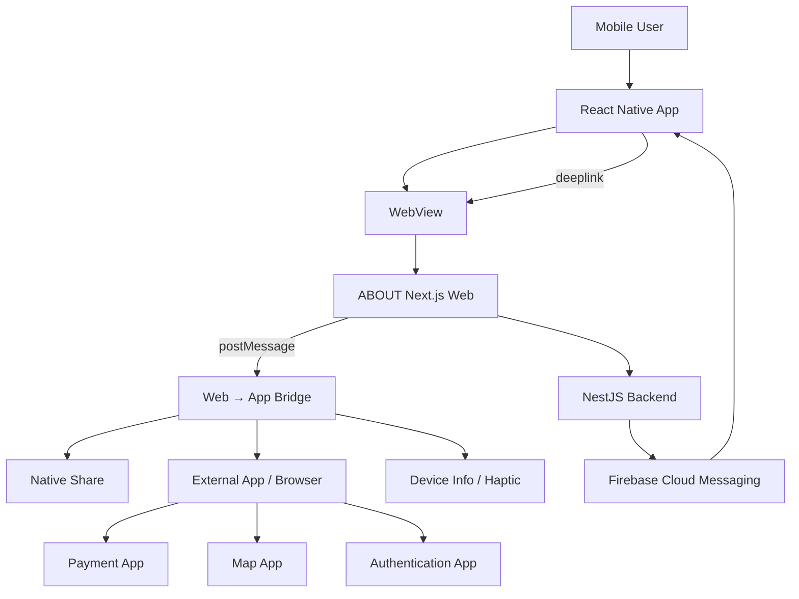
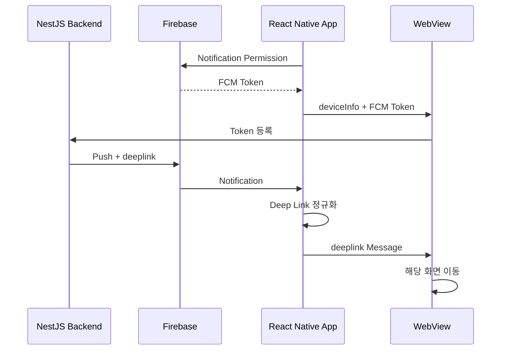

# ABOUT Mobile App

> ABOUT 웹 서비스를 iOS·Android 앱 환경에 연결하는 **React Native WebView 애플리케이션**입니다.

본 저장소는 ABOUT 모바일 앱의 네이티브 셸을 담당합니다.  
제품 화면과 주요 비즈니스 기능은 Next.js 웹 프론트엔드를 공통으로 사용하고, 앱에서만 필요한 푸시 알림·딥링크·외부 앱 실행·기기 정보·공유·햅틱 등의 기능을 React Native로 연결합니다.

- Web: [about20s.club](https://about20s.club)
- Cafe Map: [카공지도.com](https://카공지도.com)
- Frontend: [AboutClan/About](https://github.com/AboutClan/About)
- Backend: [AboutClan/nest-back](https://github.com/AboutClan/nest-back)
- Instagram: [@about._.20s](https://www.instagram.com/about._.20s)

---

## App Overview

ABOUT은 대학생과 취업 전 20대가 공부·취미·문화생활을 함께할 사람과 활동을 찾을 수 있도록 만든 커뮤니티 서비스입니다.

초기에는 빠르게 제품을 출시하고 검증하기 위해 PWA로 운영했습니다. 이후 카카오 로그인 복귀, 외부 결제 앱 연동, 푸시 알림과 딥링크처럼 PWA만으로 안정적으로 처리하기 어려운 기능이 늘어나면서 React Native 앱으로 전환했습니다.

웹과 앱을 각각 다시 개발하지 않고, 기존 웹 서비스를 WebView에서 공통으로 사용하면서 필요한 네이티브 기능만 브리지로 연결하는 구조를 선택했습니다.

```text
React Native App
├── WebView
│   └── ABOUT Next.js Web
├── Native Bridge
│   ├── 공유
│   ├── 전화·문자
│   ├── 진동·햅틱
│   ├── 외부 링크·지도 앱
│   ├── 기기·FCM 정보
│   └── 앱 종료
├── FCM Push Notification
├── Deep Link
├── External Payment App
└── Force Update
```

---

## Why WebView

ABOUT은 웹에서 모임·소모임·스터디·카공지도·결제·관리자 기능을 계속 빠르게 개선하는 서비스입니다.

웹과 네이티브 화면을 별도로 구현하면 다음 문제가 발생합니다.

- 같은 기능을 두 번 개발해야 합니다.
- 웹과 앱의 배포 시점이 달라질 수 있습니다.
- 기능과 운영 정책 변경을 양쪽에서 맞춰야 합니다.
- 작은 팀에서 유지보수 비용이 크게 증가합니다.

따라서 다음 원칙으로 앱을 구성했습니다.

| 영역 | 담당 |
| --- | --- |
| 화면과 서비스 기능 | Next.js Web |
| 앱 실행 환경 | React Native |
| 웹·앱 통신 | `postMessage` Bridge |
| 푸시 수신·권한·토큰 | React Native + Firebase |
| 외부 앱·커스텀 스킴 | React Native + Native Module |
| 인증·결제 후 복귀 | Deep Link |
| 앱스토어 배포 | Android·iOS Native Project |

이 구조를 통해 웹의 빠른 기능 배포를 유지하면서도, 앱에서 필요한 네이티브 경험을 제공합니다.

---

## Core Features

### WebView Shell

- ABOUT 웹 서비스 로드
- 앱 전용 User-Agent 적용
- Safe Area 처리
- WebView 로딩 화면
- 개발 환경 WebView 디버깅
- 페이지별 iOS 뒤로가기 제스처 제어
- WebView Content Process 종료 시 자동 Reload
- Android 하드웨어 뒤로가기 전달
- 외부 브라우저로 열어야 하는 경로 분리

### Web → App Bridge

웹에서 `window.ReactNativeWebView.postMessage()`를 통해 네이티브 기능을 요청합니다.

현재 처리하는 메시지 유형은 다음과 같습니다.

| Message | Native Action |
| --- | --- |
| `share` | 네이티브 공유 시트 실행 |
| `callPhone` | 전화 앱 실행 |
| `sendTextMessage` | 문자 앱 실행 |
| `vibrate` | 기기 진동 |
| `haptic` | 가벼운 햅틱 피드백 |
| `getDeviceInfo` | 기기·앱·FCM 정보 전달 |
| `openExternalLink` | 외부 앱 또는 브라우저 실행 |
| `exitApp` | Android 앱 종료 |
| `webviewReady` | 웹 준비 완료 및 대기 중인 딥링크 처리 |

브리지 메시지는 JSON으로 전달하며, `type`과 `name` 형식을 모두 읽어 기존·신규 웹 코드와 호환합니다.

### App → Web Bridge

앱은 WebView에 다음 정보를 전달합니다.

| Message | Purpose |
| --- | --- |
| `deeplink` | 특정 서비스 화면으로 이동 |
| `backAction` | Android 하드웨어 뒤로가기 처리 |
| `deviceInfo` | FCM 토큰·플랫폼·앱 버전·빌드 번호 전달 |

```json
{
  "name": "deviceInfo",
  "fcmToken": "...",
  "deviceId": "...",
  "platform": "android",
  "appVersion": "1.0.0",
  "buildNumber": "1"
}
```

실제 토큰과 기기 정보는 서버에 등록될 수 있으므로 로그와 외부 공유 시 주의해야 합니다.

### Push Notification

Firebase Cloud Messaging을 사용합니다.

- Android·iOS 알림 권한 확인
- 권한이 없는 경우 사용자 요청
- FCM 토큰 발급
- 플랫폼·앱 버전·빌드 번호와 함께 웹에 전달
- 백그라운드 알림 클릭 처리
- 종료 상태에서 알림으로 앱 실행
- 알림 데이터의 딥링크를 웹 화면 이동으로 연결
- Android 알림 채널 생성
- iOS Foreground 알림을 Local Notification으로 보완
- iOS 중복 알림 방지

iOS Foreground 알림은 메시지 ID 또는 제목·본문·딥링크 조합을 기준으로 중복 여부를 판단합니다. 동일 알림은 15초 이내에 다시 표시하지 않습니다.

### Deep Link

앱 실행 상태에 따라 딥링크를 다르게 처리합니다.

```text
딥링크 수신
→ URL 형식 정규화
→ Path와 Query Parameter 분리
→ WebView 준비 상태 확인
├── 준비 완료: 즉시 전달
└── 준비 전: Pending Queue 저장
    → webviewReady 수신
    → WebView로 전달
```

지원하는 진입 경로는 다음과 같습니다.

- 커스텀 앱 스킴
- `about20s.club` 웹 링크
- 기존 서비스 도메인 링크
- 카카오 공유 링크
- FCM 알림의 `deeplink`
- 앱이 종료된 상태의 Initial URL
- 앱 실행 중 전달되는 URL Event

콜드스타트에서는 웹 라우터가 준비되기 전에 딥링크가 도착할 수 있습니다. 이 경우 값을 임시 저장하고 웹의 `webviewReady` 메시지를 받은 뒤 전달해 링크 유실을 방지합니다.

### External App Integration

WebView 내부에서 처리할 수 없는 URL은 앱에서 가로채 외부 앱으로 전달합니다.

- 카카오톡
- 카카오페이
- PASS
- 네이버지도
- 카카오맵
- Apple 지도
- 전화
- 문자
- Google Play Store
- YouTube
- 일반 외부 브라우저

지도 앱이 설치되어 있지 않으면 해당 서비스의 웹 검색 주소로 이동합니다.

| Scheme | Fallback |
| --- | --- |
| `nmap://search` | 네이버지도 웹 검색 |
| `kakaomap://search` | 카카오맵 웹 검색 |
| `maps://` | Apple Maps 웹 주소 |

### Android Intent Module

Android 결제·인증 과정에서는 `intent://` 형식이 사용될 수 있습니다.

React Native 기본 `Linking`만으로 처리되지 않는 경우를 위해 `IntentModule`을 직접 등록했습니다.

처리 순서는 다음과 같습니다.

```text
intent:// URL 수신
→ Android Intent로 Parsing
→ 처리 가능한 앱 실행
→ 앱이 없으면 browser_fallback_url
→ fallback도 없으면 package 기반 Play Store 이동
```

이를 통해 카카오페이 등 외부 결제 앱 실행 실패 시 사용자가 중간에 막히지 않도록 처리합니다.

### Force Update

앱 버전이 최소 지원 버전보다 낮으면 종료할 수 없는 업데이트 모달을 노출합니다.

- Android·iOS 최소 버전 분리
- Semantic Version 비교
- WebView 준비 이후 버전 확인
- Android Play Store 이동
- iOS App Store 이동
- 모달 노출 중 Android 뒤로가기 차단

현재 최소 지원 버전은 `App.tsx` 내부 상수로 관리합니다. 앱 배포 시 수동으로 값을 확인하고 수정해야 합니다.

### Network State

`@react-native-community/netinfo`로 네트워크 연결 상태를 감지합니다.

- 앱 실행 시 현재 연결 상태 확인
- 네트워크 변경 Event 구독
- 오프라인 상태에서 WebView 렌더링 제한

현재 오프라인 전용 안내 화면은 제공하지 않으며, 연결이 끊기면 빈 화면을 반환합니다.

### Splash & Safe Area

- Android·iOS Native Splash Screen
- React Native 초기화 후 일정 시간 뒤 Splash 종료
- iPhone Notch와 Android System Bar Safe Area 처리
- 상태바 배경색과 아이콘 스타일 통일

---

## App Architecture



### Runtime Flow

```text
App Launch
→ Native Splash
→ React Native Initialization
→ Notification Setup
→ Initial Deep Link 확인
→ WebView Load
→ Web sends webviewReady
→ Pending Deep Link 전달
→ Device·FCM 정보 전달
→ Service 사용
```

---

## Bridge Protocol

### Web에서 앱으로 보내기

```ts
window.ReactNativeWebView?.postMessage(
  JSON.stringify({
    type: "openExternalLink",
    link: "https://example.com"
  })
);
```

`type` 또는 `name` 중 하나를 메시지 식별자로 사용할 수 있습니다.

### 앱에서 웹으로 보내기

```ts
webviewRef.current?.postMessage(
  JSON.stringify({
    name: "deeplink",
    path: "/gather/123",
    params: {
      source: "push"
    }
  })
);
```

웹 프론트엔드는 전달받은 `name`에 따라 라우팅이나 기기 정보 저장을 처리해야 합니다.

### Bridge Contract 변경 시

브리지 형식을 변경할 때는 다음 저장소를 함께 확인해야 합니다.

1. `AboutClan/app`
2. `AboutClan/About`

앱과 웹의 배포 시점이 다를 수 있으므로 기존 메시지 형식을 즉시 제거하지 않고, 일정 기간 호환 처리를 유지하는 것이 안전합니다.

---

## Deep Link Flow

### 실행 중인 앱

```text
Linking URL Event
→ URL 정규화
→ Path·Query Parsing
→ WebView postMessage
→ Next.js Router 이동
```

### 종료 상태의 앱

```text
Linking.getInitialURL()
또는 FCM getInitialNotification()
→ Pending Deep Link 저장
→ WebView Load
→ webviewReady
→ Deep Link 전달
```

### 카카오 공유 링크

카카오 링크의 Query Parameter에서 실제 이동 경로를 추출한 뒤 앱 내부 경로로 변환합니다.

Query가 중첩 인코딩된 경우를 고려해 다음 순서로 처리합니다.

1. `dl` 또는 `path` 확인
2. Query 전체 Decode 후 재확인
3. 정규식 기반 Fallback
4. 앱 내부 Scheme으로 정규화

### 유지보수 주의사항

딥링크는 다음 설정이 함께 맞아야 합니다.

- `App.tsx` URL 정규화
- Android `AndroidManifest.xml`
- iOS `Info.plist`
- 카카오 개발자 콘솔
- 웹의 딥링크 수신 코드
- FCM Payload의 `deeplink`

Scheme이나 도메인을 변경할 때 한쪽만 수정하면 플랫폼·실행 상태별로 링크가 동작하지 않을 수 있습니다.

---

## Push Notification Flow



### 앱 상태별 처리

| App State | Handling |
| --- | --- |
| Foreground | iOS Local Notification 보완 |
| Background | `onNotificationOpenedApp` |
| Terminated | `getInitialNotification` |
| URL Scheme Launch | `Linking.getInitialURL` |
| Running URL Event | `Linking.addEventListener` |

---

## Tech Stack

| Category | Technologies |
| --- | --- |
| Framework | React Native 0.77.3 |
| Language | TypeScript 5 |
| UI Runtime | React 18.3.1 |
| Web Integration | react-native-webview |
| Push | Firebase Messaging, react-native-push-notification |
| Analytics | Firebase Analytics |
| Permission | react-native-permissions |
| Network | NetInfo |
| Device | react-native-device-info |
| Native UX | react-native-share, Haptic Feedback, Vibration |
| Layout | react-native-safe-area-context |
| Splash | react-native-splash-screen |
| Android Native | Java Native Module, Gradle |
| iOS Native | Objective-C++, CocoaPods |
| Test | Jest, React Test Renderer |
| Quality | ESLint, Prettier |
| Patch | patch-package |

### Native Runtime Configuration

- Android Application ID: `com.about.studyaboutclubapp`
- Android Release Build: ProGuard 활성화
- Android Firebase: Google Services Plugin
- iOS Firebase: Core·Analytics·Messaging
- iOS New Architecture: 비활성화
- iOS Fabric: 비활성화
- iOS Hermes: 비활성화
- iOS JavaScript Runtime: JavaScriptCore

---

## Project Structure

```text
.
├── App.tsx                    # WebView·브리지·푸시·딥링크 중심 로직
├── index.js                   # React Native Entry Point
├── app.json                   # 앱 이름
├── android/
│   ├── app/
│   │   ├── build.gradle       # 앱 버전·서명·ProGuard·Firebase
│   │   └── src/main/
│   │       ├── AndroidManifest.xml
│   │       └── java/com/about/studyaboutclubapp/
│   │           ├── MainActivity.java
│   │           ├── MainApplication.java
│   │           └── IntentModule.java
│   ├── build.gradle
│   ├── gradle.properties
│   └── settings.gradle
├── ios/
│   ├── 어바웃/
│   │   ├── AppDelegate.h
│   │   ├── AppDelegate.mm
│   │   ├── Info.plist
│   │   └── LaunchScreen.storyboard
│   ├── 어바웃.xcodeproj/
│   ├── 어바웃.xcworkspace/
│   ├── GoogleService-Info.plist
│   └── Podfile
├── patches/                   # patch-package Patch
├── __tests__/
│   └── App.test.tsx
├── babel.config.js
├── metro.config.js
├── react-native.config.js
├── jest.config.js
├── tsconfig.json
├── Gemfile
└── package.json
```

`App.tsx`에 앱의 핵심 런타임 로직이 집중되어 있습니다. 기능이 계속 확장될 경우 WebView, Push, Deep Link, Bridge, Force Update 로직을 별도 Hook과 Module로 분리하는 것을 검토할 수 있습니다.

---

## Getting Started

### Requirements

- Node.js 18 이상
- npm 또는 Yarn 1
- React Native 개발 환경
- Android Studio
- Android SDK
- JDK
- macOS와 Xcode — iOS 개발 시
- CocoaPods — iOS 개발 시
- 실제 Firebase 설정 파일

React Native 공식 환경 설정을 먼저 완료해야 합니다.

### Installation

```bash
git clone https://github.com/AboutClan/app.git
cd app
npm install
```

설치 후 `patch-package`가 자동 실행됩니다.

### Firebase Configuration

앱 실행을 위해 플랫폼별 Firebase 설정 파일이 필요합니다.

```text
android/app/google-services.json
ios/GoogleService-Info.plist
```

운영 프로젝트의 설정 파일에는 민감한 프로젝트 정보가 포함될 수 있으므로 외부 공유와 저장소 공개 범위를 확인해야 합니다.

### Start Metro

```bash
npm start
```

### Android

별도 터미널에서 실행합니다.

```bash
npm run android
```

Release Mode로 기기에 실행하려면 다음 Script를 사용합니다.

```bash
npm run android:prod
```

### iOS

처음 실행하거나 Native Dependency가 변경됐다면 Pod를 설치합니다.

```bash
cd ios
bundle install
bundle exec pod install
cd ..
```

앱을 실행합니다.

```bash
npm run ios
```

Xcode에서 실행할 때는 `.xcodeproj`가 아니라 다음 Workspace를 사용합니다.

```text
ios/어바웃.xcworkspace
```

### Test

```bash
npm test
```

현재 기본 테스트는 App Component가 정상적으로 렌더링되는지 확인하는 Smoke Test입니다.

### Lint

```bash
npm run lint
```

---

## Android Build

### Clean

```bash
npm run android-clean
```

### APK

```bash
npm run apk:android
```

결과 파일은 다음 경로에 생성됩니다.

```text
android/app/build/outputs/apk/release/
```

### AAB

```bash
npm run aab:android
```

결과 파일은 다음 경로에 생성됩니다.

```text
android/app/build/outputs/bundle/release/
```

### Release Signing

Android Release Build는 `android/key.properties`의 서명 정보를 사용합니다.

예시 형식입니다.

```properties
RELEASE_STORE_FILE=release-key.keystore
RELEASE_STORE_PASSWORD=...
RELEASE_KEY_ALIAS=...
RELEASE_KEY_PASSWORD=...
```

실제 Keystore와 비밀번호는 저장소에 커밋하지 않습니다.

Release Signing 정보가 없으면 Debug Build는 가능하지만 Release Build가 실패할 수 있습니다.

---

## iOS Build

### CocoaPods

```bash
cd ios
bundle install
bundle exec pod install
```

Pod 설치 문제가 발생하면 다음 순서로 초기화할 수 있습니다.

```bash
npm run ios-clean
cd ios
bundle exec pod install
cd ..
```

`ios-clean`은 Pods, Podfile.lock과 Xcode DerivedData를 삭제하므로 작업 중인 Native 설정이 없는지 확인한 뒤 실행해야 합니다.

### Xcode

1. `ios/어바웃.xcworkspace`를 엽니다.
2. Signing & Capabilities를 확인합니다.
3. Bundle Identifier와 Provisioning Profile을 확인합니다.
4. Firebase와 Push Notification Capability를 확인합니다.
5. 실제 기기 또는 Simulator에서 실행합니다.

iOS Push Notification은 APNs 설정과 Firebase Messaging 설정이 모두 필요합니다.

---

## Release Checklist

### Common

- 웹 배포 버전과 앱 브리지 호환 확인
- 최소 지원 버전 상수 확인
- Push Notification 권한과 토큰 등록 확인
- Foreground·Background·종료 상태 알림 확인
- Deep Link Path와 Query Parameter 확인
- 카카오 로그인 후 앱 복귀 확인
- 결제 앱 실행과 결제 후 복귀 확인
- 지도 앱 설치·미설치 상태 확인
- 오프라인·네트워크 복구 확인
- 실기기에서 Safe Area 확인

### Android

- `versionCode` 증가
- `versionName` 확인
- `key.properties`와 Keystore 확인
- Release AAB 생성
- ProGuard Release Build 확인
- `intent://` 결제·인증 앱 실행 확인
- App Link와 Custom Scheme 확인
- FCM Notification Channel 확인

### iOS

- Marketing Version 확인
- Build Number 증가
- Signing과 Provisioning 확인
- APNs·Firebase 설정 확인
- Custom URL Scheme 확인
- Background Notification 확인
- Archive와 App Store Connect Upload 확인
- iOS Foreground 중복 알림 확인

---

## Troubleshooting

### WebView가 빈 화면으로 표시되는 경우

1. 기기 네트워크 상태를 확인합니다.
2. `https://study-about.club/`에 브라우저로 접속 가능한지 확인합니다.
3. Metro와 Native Log를 확인합니다.
4. WebView `onError` Log를 확인합니다.
5. User-Agent에 따른 웹 접근 제한이 없는지 확인합니다.

현재 오프라인 상태에서는 별도 안내 없이 빈 View를 반환하므로 네트워크 오판 여부도 확인해야 합니다.

### 딥링크가 열리지 않는 경우

다음 항목을 함께 확인합니다.

- Android `AndroidManifest.xml`
- iOS `Info.plist`
- `App.tsx` Scheme 정규화
- 카카오 링크 Parameter
- FCM의 `deeplink`
- 웹의 `webviewReady`
- 웹의 딥링크 메시지 처리
- 앱이 Foreground·Background·Terminated 중 어느 상태였는지

### 푸시 알림이 오지 않는 경우

- 알림 권한
- FCM Token 발급
- 웹으로 `deviceInfo` 전달 여부
- 백엔드에 저장된 Token
- Android Notification Channel
- iOS APNs Capability
- Firebase 설정 파일
- 앱 상태별 Handler

### Android 외부 결제 앱이 열리지 않는 경우

- URL이 `intent://` 형식인지 확인합니다.
- `IntentModule` 등록 여부를 확인합니다.
- 대상 앱이 설치되어 있는지 확인합니다.
- `browser_fallback_url` 존재 여부를 확인합니다.
- Intent에 Android Package가 포함됐는지 확인합니다.
- Play Store Fallback을 확인합니다.

### iOS Build가 실패하는 경우

```bash
npm run ios-clean
cd ios
bundle exec pod install
```

이후 Xcode의 DerivedData, Signing, Deployment Target과 Pod Build Setting을 확인합니다.

---

## Current Maintenance Notes

### 최소 지원 버전 수동 관리

강제 업데이트 기준 버전이 `App.tsx`에 하드코딩되어 있습니다. 앱 심사와 배포 없이 기준을 바꿀 수 없으므로 장기적으로는 Remote Config 또는 서버 설정으로 이전할 수 있습니다.

### App.tsx 책임 집중

WebView, Push, Deep Link, Bridge, Force Update와 외부 앱 실행이 하나의 파일에 집중되어 있습니다.

기능 확장 시 다음 단위로 분리할 수 있습니다.

```text
src/
├── config/
│   └── appConfig.ts
├── bridge/
│   ├── messageTypes.ts
│   └── useWebViewBridge.ts
├── deeplink/
│   ├── normalizeDeepLink.ts
│   └── useDeepLink.ts
├── notification/
│   └── usePushNotification.ts
├── native/
│   └── externalLink.ts
└── components/
    ├── AppWebView.tsx
    └── ForceUpdateModal.tsx
```

현재 저장소에는 위 구조가 적용되어 있지 않으며, 실제 코드는 Root `App.tsx` 중심입니다.

### 딥링크 설정 동기화

앱 내부의 URL 정규화 문자열과 Android·iOS 플랫폼 설정은 함께 변경해야 합니다. 과거 Scheme 호환 코드가 남아 있을 수 있으므로 신규 Scheme 적용 전 전체 진입 경로를 실기기에서 확인해야 합니다.

### 오프라인 UX

현재 네트워크가 끊기면 빈 화면을 반환합니다. 사용자에게 재시도 버튼과 연결 상태 안내를 제공하는 전용 화면이 필요할 수 있습니다.

### 테스트 범위

현재 자동 테스트는 App Render Smoke Test 중심입니다.

추가 우선순위가 높은 테스트 대상은 다음과 같습니다.

- 딥링크 정규화
- Query Parameter Parsing
- Semantic Version 비교
- 지도 앱 Fallback URL
- Bridge Message Parsing
- iOS 알림 중복 제거
- Android Intent Fallback

---

## Ownership

초기 PWA 앱은 이승주가 직접 기획·개발했습니다.

React Native 전환은 다음과 같이 역할을 구분합니다.

| Area | Role |
| --- | --- |
| PWA 앱 기획·개발 | 이승주 직접 담당 |
| React Native 전환 방향·요구사항 | 이승주 직접 설계 |
| 최초 Android·iOS 프로젝트 설정 | 협업 개발자 |
| WebView 서비스 연결 | 이승주 지속 담당 |
| 웹·앱 메시지 브리지 | 이승주 지속 담당 |
| 인증·결제 앱 복귀 | 이승주 지속 담당 |
| 딥링크·FCM·강제 업데이트 | 이승주 지속 담당 |
| 이후 유지보수·운영 | 이승주 지속 담당 |

최초 Native Project 기반 설정은 협업했으며, 이후 ABOUT과 카공지도 앱의 기능 수정·웹 연동·운영은 이승주가 주도했습니다.

---

## Related Repositories

| Repository | Description |
| --- | --- |
| [AboutClan/About](https://github.com/AboutClan/About) | Next.js 웹 프론트엔드 |
| [AboutClan/nest-back](https://github.com/AboutClan/nest-back) | NestJS 백엔드 |
| [AboutClan/app](https://github.com/AboutClan/app) | React Native 앱 |
